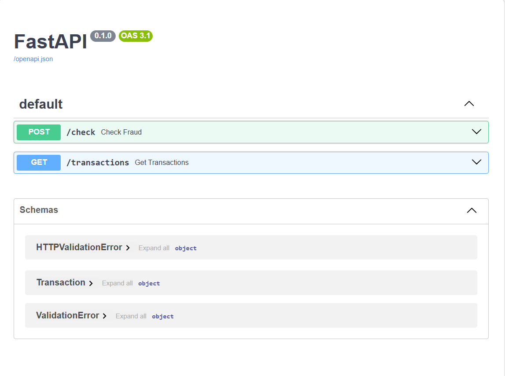

# 🚀 Fraud Detection System

## 📌 Overview
This project is a simple **Fraud Detection System** built using **FastAPI**.  
It allows users to input transaction details and checks whether it is **Fraud or Normal**.

---

## 🛠 Tech Stack
- Backend: FastAPI (Python)
- Frontend: HTML, CSS, JavaScript
- Database: SQLite

---

## ⚙️ Features
- User input form
- API-based fraud detection
- Data stored in database
- Real-time result display

---

## 🔄 Workflow
Frontend → FastAPI Backend → SQLite Database → Response

---

## 📸 Screenshot

### Home Page

---

## ▶️ How to Run

### 1. Install dependencies
```bash
pip install -r requirements.txt

### 🚀 Future Enhancements
Docker containerization
CI/CD (GitHub Actions)
Redis caching
PostgreSQL database
Machine Learning model


### 👩‍💻 Author
Swarupa Bagawade
